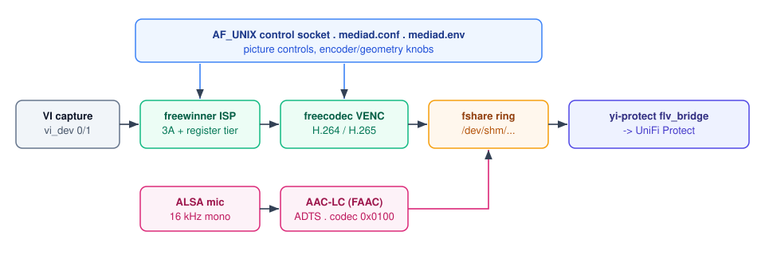

# yi-mediad — a clean-room media daemon for Yi/V831 cameras

<div align="center">

<a href="LICENSE"></a>
<a href="../../releases"></a>

**A drop-in replacement for the stock `rmm` media daemon on Allwinner V831-class
Yi cameras.**
**It publishes the same `/dev/shm/fshare_frame_buf` ring the stock daemon does,
so the [yi-protect](https://github.com/hutchx86/yi-protect) Protect bridge is
untouched — but with clean-room capture, ISP and H.264/H.265 encode, and a
picture-control surface the stock daemon never had.**

</div>

> [!WARNING]
> **Proof of concept, not a product.** It runs custom binaries on your camera and
> changes what it launches: you can **brick the camera**, lose recordings and void
> its warranty. See [Disclaimer](#disclaimer).

> [!NOTE]
> Not affiliated with Yi Technology / Kami or Allwinner. No Yi/Kami or Allwinner
> firmware or binaries are distributed here. Built with AI assistance under human
> review. See [Legal](#legal).

## Quick start

A prebuilt overlay is published on the repo's [Releases](../../releases) page;
install it on a camera that already runs yi-protect:

```
mkdir -p /tmp/sd/mediad-overlay
tar xzf yi-mediad-<tag>.tar.gz -C /tmp/sd/mediad-overlay
sh /tmp/sd/mediad-overlay/install-mediad.sh      # SD root defaults to /tmp/sd
# reboot
```

`IS_MEDIAD=auto` (the default) selects `mediad` on the next boot. Full detail:
[Install](#install).

## At a glance

|  |  |
| --- | --- |
| **What** | Clean-room drop-in replacement for the stock Yi `rmm` media daemon |
| **Hardware** | Yi cameras on Allwinner sun8iw19 / V831 (y623, h51ga, h52ga, r35gb, y291ga) |
| **Interface** | Publishes the stock `/dev/shm/fshare_frame_buf` ring; `AF_UNIX` control socket |
| **Language** | C (ARMv7, musl) |
| **Status** | Working on real hardware (capture, ISP, encode, ring, control surface); proof of concept |
| **License** | AGPL-3.0-only (+ GNU AGPL section 7 vendor-encoder linking permission) |

## How it compares

|  | Stock `rmm` | This project |
| --- | --- | --- |
| **Encoder** | vendor H.264 only | clean-room **H.264 + H.265** |
| **ISP / 3A** | vendor `libisp` archive | clean-room [freewinner](https://github.com/hutchx86/freewinner) |
| **AAC** | `libaacenc.a` | freecodec wrapper over FAAC |
| **Picture controls** | none | `AF_UNIX` control socket + Protect settings page |
| **Tuning** | compiled into the blob | read at runtime from the camera's own `rmm`, cached on SD |
| **Distribution** | binary-only | source, AGPL-3.0-only |

## How it works

`mediad` owns sensor capture → ISP → hardware encode → the stock ring, plus the
mic AAC track. It is not a new protocol: it publishes the same shared-memory ring
the stock `rmm` does, so `yi_protect_flv_bridge` / UniFi Protect read it
unchanged and the two encoders are interchangeable.



| File | Role |
| --- | --- |
| `main.c` | VI/ISP bring-up, channel config, bitrate, frame throttle |
| `fshare.{c,h}` | The stock ring producer |
| `mediad_venc.{c,h}` | H.264 encoder channel over the clean-room freecodec engine |
| `mediad_audio.{c,h}` | Mic capture (ALSA) → AAC-LC (freecodec) → ring |
| `audio_codec.c` | Enables the SoC codec hub/mic mixer controls before capture |
| `talkback.c` | Desktop talkback: FIFO → ALSA speaker playback |
| `osd.c`, `osd_font.h` | Burned-in OSD (date/name/logo/bitrate); Terminus Bold (OFL) |
| `isp_config.c`, `stub_audio_components.c` | ISP tuning import + control appliers |
| `isp_control.{c,h}` | Control socket, `mediad.conf`, night vision, optional slider page |
| `rmm_tuning.{c,h}` | On-camera tuning extraction from `/home/app/rmm` (+ SD cache) |
| `stock_reg.c` | Optional stock register-table replay wrapper |
| `tools/`, `rmm_extract.c` | Extractor CLI, `mediad_ctl`, layout/build tools |
| `../vin_crop_shim/` | Optional `LD_PRELOAD` capture crop (unused with the default per-model geometry) |

## Supported hardware

Allwinner **sun8iw19**, ~60 MB RAM, BusyBox userland.

| Model | Camera | Sensor | HIGH geometry |
| --- | --- | --- | --- |
| `y623` | Yi **Pro 2k** (PCB may read `y621`) | `gc3003_mipi` | 2304×1296 |
| `h51ga` | Yi **Dome Camera U** (2K) | `gc2053_mipi` | 1920×1080 (native; stock `rmm` upscales to 2K) |
| `h52ga` | Yi **Dome Camera U** (Full HD) | `gc2053_mipi` | 1920×1080 |
| `r35gb` | Yi **Dome Guard** | `gc2053_mipi` | 1920×1080; rotated 180° |
| `y291ga` | Yi **1080p Home** | `gc2053_mipi` | 1920×1080 |

Geometry is keyed on the **model** (a built-in `g_models` capture/encode row),
because several models share one sensor yet stream different sizes. The sensor
row is only the fallback for an unlisted model (best-effort 16:9).

## Features

- **Drop-in producer** — publishes H.264 NALs (Annex-B, SPS/PPS re-emitted per
  IDR) onto the stock ring at the stock offset/header size.
- **Two video channels** — HIGH (`vi_dev 0`) and LOW (640×360, `vi_dev 1`), both
  20 fps, the stock two-vipp topology; `MEDIAD_LOW=0` for HIGH-only.
- **Hardware H.264 / H.265 encode** — the clean-room **freecodec** engine
  (statically linked) plus `libvenc_base.so`; no vendor blob. H.265 is validated
  on `y623` only.
- **Bitrate** — HIGH 2.8 Mbps / LOW 0.7 Mbps by default; HIGH adjustable from
  Protect and persisted. `MEDIAD_HIGH_BPS` / `MEDIAD_LOW_BPS` override at boot.
- **Mic audio** — ALSA capture → AAC-LC, 16 kHz mono, ADTS, into the same ring.
- **ISP pipeline** — the clean-room `freewinner` libisp framework, 3A and
  register/config tiers, on the V831 ISP-521 ABI.
- **On-camera vendor tuning** — reads the camera's own OEM ISP config from
  `/home/app/rmm` at first init, remaps it, caches it on SD. No blob or
  per-firmware address is compiled in.
- **WDR + PLTM**, **night vision** (IR-cut + IR LED + day/night ISP tuning swap;
  auto at a lux threshold), **shutter exposure** (Auto / Frame Capture / Best Low
  Light).
- **Control surface** — an `AF_UNIX` socket plus `mediad.conf`; see
  [Configuration](#configuration).
- **Robustness** — self-watchdog (exit after 15 s with no frames); `oom_score_adj=-1000`;
  `nbufs=3` to fit the 60 MB box.
- **Burned-in OSD** — date/time, camera name, bitrate/stats line and a logo,
  rendered camera-side into the encoder overlay engine.

## Requirements

- A supported Yi camera (above) with an SD card already running **yi-protect**
  (this overlay installs on top of it).
- A build host with `git`, `curl`, `make`, `python3`, `patch`, `tar`, and the
  musl cross-toolchain (fetched for you).

## Repository layout

```
media_daemon/   the daemon (see the file table above)
vin_crop_shim/  optional capture-crop LD_PRELOAD
package/        SD-card overlay installer + package README
docs/           env vars, build knobs
build.sh        fetch toolchain/SDK/FAAC + build deps
package.sh      deploy build -> dist/ (the overlay)
```

## Install

A prebuilt overlay is published on [Releases](../../releases)
(`yi-mediad-<tag>.tar.gz` + `SHA256SUMS`); download and install it directly, no
build needed:

```
mkdir -p /tmp/sd/mediad-overlay
tar xzf yi-mediad-<tag>.tar.gz -C /tmp/sd/mediad-overlay
sh /tmp/sd/mediad-overlay/install-mediad.sh      # SD root defaults to /tmp/sd
# reboot
```

Which flow you are at doesn't change the install step; both are covered in
[package/README.md](package/README.md):

- **No yi-protect yet** — install yi-protect first (see its README), then overlay
  the downloaded archive.
- **Already running yi-protect** on the stock `rmm` — overlay the archive.

To build it yourself instead: `./build.sh && ./package.sh`, then copy `dist/` to
the card as its own folder (do not overwrite the card's `yi-protect/`), run
`sh /tmp/sd/mediad-dist/install-mediad.sh` on the camera, and reboot. The
installer copies `yi-protect/{bin,etc,script,lib}`, sets `IS_MEDIAD=yes`, and
reroutes `init.sh`/`watchdog.sh` to `mediad.sh start`, keeping `.pre-mediad`
backups. `mediad.sh candidate <file>` installs a new binary and starts it, with
no automatic rollback.

## Configuration

`mediad` listens on an `AF_UNIX` socket (`/tmp/mediad_ctl.sock`, `MEDIAD_CTL_SOCK`):
`set <key> <n>`, `get <key>`, `list`, `reset`, `ping`, `pin <key> <n>`,
`unpin <key>`, `pinned <key>`. Picture levels are 0–100 with 50 = stock.

- **Web UI:** yi-protect's settings page (`http://<camera>/`, `WEBUI_PORT`,
  default 80, 0 = off) edits and pins these values. mediad also has a minimal
  built-in slider page, off by default (`webui=1`, `webui_port=8099`).
- **`mediad.conf`** (`/tmp/sd/yi-protect/etc/mediad.conf`, `MEDIAD_CONF`):
  `key=value` lines are applied at boot and **pinned**, so Protect's connect-time
  re-assert cannot override them; `pin_<key>=value` sets a boot value without pinning.
- **Environment:** encoder, geometry and bring-up knobs are environment
  variables set in `yi-protect/etc/mediad.env`: see [docs/env.md](docs/env.md).

Keys include `brightness`, `contrast`, `saturation`, `hue`, `sharpness`,
`denoise`, `tdf`, `nr2d`, `cnr`, `venc3d`, `exposure`, `aebias`, `gamma`, `pltm`,
`wdr`/`hdr`, `flicker`/`frequency`, `mirror`, `flip`, `bitrate`, `nightvision`,
`night_lux`, `ir_cut`, `ir_led`, `shutter` and the `osd*` switches (`mediad_ctl
list` prints them).

## Verification

- Host tests: `make -C media_daemon test-hevc` (H.265 policy), plus freewinner's
  own `make -C isp check` / `make -C codec check`.
- On camera: capture, ISP, hardware encode, the ring, the vendor-tuning import and
  the control surface verified on real hardware; both channels stream and decode
  with zero macroblock errors.

## Roadmap / known limitations

The goal — a deploy build with no proprietary blob — is reached: a bare `make`
(what `package.sh` runs) compiles no vendor source, includes no vendor header and
links no vendor object.

- **ISP 3A + register/config** — *done* (clean-room freewinner).
- **AAC** — *done* (freecodec over FAAC; `libaacenc.a` not linked).
- **H.264/H.265 encoder + `libvenc_base.so`** — *done* (clean-room freecodec).
  Residual gap vs the vendor engine: rate control / ME (roughly 2–4× the bits at
  the same QP).
- **MPP middleware** (`fenc_`/`fisp_`/`fcap_`) — *done*; the SDK is fetched at
  build time for the optional vendor comparison builds but contributes no object
  to the shipped binary.
- **Known:** the SDK is only needed for vendor comparison builds; see
  [docs/build-knobs.md](docs/build-knobs.md).

## Changelog

- **2026-10-03** — repo flattened (`work/` removed); overlay release now built and
  published by CI; README restructured.
- **2026-10-02** — model-keyed capture geometry (no per-model `.env`).
- **2026-09-30** — H.265 separate module; VUI timing, configurable IDR, tracking
  rate control.
- **2026-09-29** — H.265 on-device; OSD and 3-D filter on the H.265 path.

## Credits

- **[lindenis-org](https://github.com/lindenis-org)** — the Lindenis V831 SDK
  (`eyesee-mpp`) and the musl cross-toolchain this builds against.
- **[roleoroleo](https://github.com/roleoroleo)** — the `fshare` framing and
  video-push path were reverse engineered with reference to his **rRTSPServer**;
  the boot pattern follows **yi-hack-Allwinner-v2**.
- **[freewinner](https://github.com/hutchx86/freewinner) / freecodec**
  (AGPL-3.0-only) — the clean-room ISP 3A/register tier, the H.264/H.265 encoder
  and `libvenc_base`, linked into the deploy build.
- **[yi-protect](https://github.com/hutchx86/yi-protect)** — the UniFi Protect
  bridge this daemon feeds.

Full attribution is in [`NOTICE`](NOTICE).

<a id="legal"></a>
<details>
<summary><b>Legal</b></summary>

- **Not affiliated with, or endorsed by, Yi Technology / Kami** or Allwinner.
  Product names and trademarks are used only for identification and interoperability.
- **No Yi/Kami or Allwinner firmware or binaries are distributed here.** The
  `package.sh` deploy build compiles **no** vendor Allwinner source and includes
  no vendor header: the ISP 3A/register tier, AAC, H.264/H.265, the
  VENC/ISP/capture middleware and the daemon's interface headers are all
  clean-room (AGPL-3.0-only freewinner/freecodec). The SDK is fetched at build
  time for the vendor comparison builds only and contributes no object to the
  shipped binary. See [`NOTICE`](NOTICE).
- Intended for interoperability and personal use on hardware you own. Reverse
  engineering may be restricted in your jurisdiction; you are responsible for how
  you use it.

</details>

<details>
<summary><b>Disclaimer</b></summary>

**This is a proof-of-concept project, not a production-ready system.** Review and
verify everything yourself. **This software is provided "as is", without warranty
of any kind.** It runs custom binaries on your camera and modifies what it
launches: you can **brick the camera**, lose recordings, and void its warranty. By
using it you accept full responsibility for any damage, data loss, downtime or
other consequences. **The authors and contributors are not responsible or liable
for any loss or damage arising from its use.**

</details>

## Security

Report vulnerabilities privately through
[GitHub Security Advisories](../../security/advisories/new). The build takes no
credentials; no Allwinner binaries or per-firmware blobs are stored in the repo.

## License

AGPL-3.0-only, with an additional permission (GNU AGPL section 7) for linking the
optional Allwinner vendor encoder libraries: see [LICENSE](LICENSE),
[LICENSE-EXCEPTION](LICENSE-EXCEPTION) and [NOTICE](NOTICE). Third-party
components fetched at build time (the Lindenis/Allwinner SDK, FAAC, alsa-lib)
carry their own terms; the clean-room freewinner/freecodec tiers are
AGPL-3.0-only as well.
